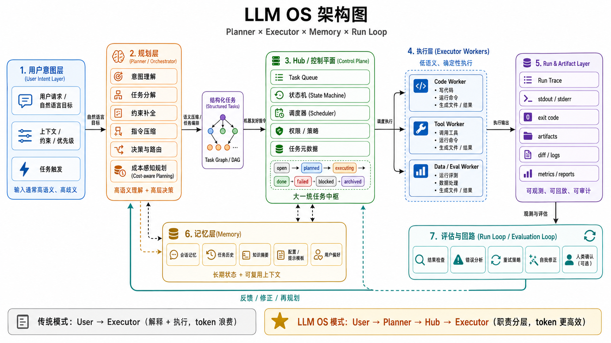

# Codex ChatGPT Hub

##实际效果预览：

Chatgpt发送任务；


hub管理器开启codex自动执行模式；


终端接收到任务，codex启动；


任务完成；


手机也可以发送指令（解耦 codex api版 和 网页端账号）


让 ChatGPT 重新做回大脑和决策者，让 Codex 回到纯粹执行者的位置。

这个项目不是要把 ChatGPT 包装成另一个代码工具，也不是让 Codex 在本地独自消耗大量 token 做完整的思维博弈。它提供一个共享 MCP Hub：ChatGPT 负责研究、权衡、计划、验收和决策；Codex 负责读写文件、运行命令、改代码、做实验、回传结果。两边通过同一套结构化记忆交换最终决策、证据链、执行记录、日志、文件片段和项目状态。

换句话说：

```text
ChatGPT = 大脑 / 决策者 / 研究与验收
Codex   = 执行者 / 工程手 / 本地操作员
Hub     = 两者共享的任务、证据、执行记录和项目记忆
```

ChatGPT 不需要直接看到 Codex 的隐藏思考过程。它需要看到的是可检索、可审计、可继续推进的外部事实：任务简报、工作区搜索结果、文件片段、Codex 执行记录、命令输出、实验产物、claim 的 evidence、framework 的 justification，以及 section 的 related-work anchor。

## LLM OS 架构：Planner × Executor × Memory × Run Loop

这个项目的核心痛点是：当 Codex 作为执行器时，如果还要同时理解复杂自然语言、拆解意图、判断优先级和处理工程细节，就会把大量 token 花在解释任务上。自然语言越长、上下文越散，Codex 的执行越容易出现偏差：同一件事可能被反复解释，隐含约束容易漏掉，本地执行也更难稳定复现。

解决方式不是让每个模型都承担完整职责，而是明确分层：

- **ChatGPT = Planner / Orchestrator**：负责理解人的意图、补全背景、拆分任务、制定验收标准，并把复杂目标压缩成结构化、低歧义的执行指令。
- **Codex = Executor**：只接收已经整理好的任务简报，在本地工作区读写文件、运行命令、改代码、执行实验，并把结果回传。
- **Hub = Memory / Control Plane**：作为 Planner 与 Executor 之间的中枢，管理任务状态、上下文、文件片段、执行记录、run 归档和可审计证据。
- **Run Loop = 持续执行闭环**：Codex worker 从 Hub 领取任务，执行后写回结果；ChatGPT 再基于结果继续决策、拆分或验收。

```text
用户意图
  |
  v
ChatGPT Planner / Orchestrator
  |  理解意图、任务分解、约束补全、指令压缩
  v
Hub Memory / Control Plane
  |  任务状态、共享上下文、run 记录、执行证据
  v
Codex Executor
  |  文件修改、命令执行、测试验证、实验产物
  v
Hub 执行结果
  |
  v
ChatGPT 验收 / 下一轮规划
```

这就是一个轻量的 LLM OS：Planner 负责高层决策，Executor 负责确定性操作，Memory 保存跨轮上下文，Run Loop 把计划、执行、反馈和验收连成闭环。职责分层之后，Codex 不必在每次执行时重新消化完整自然语言讨论，token 主要花在实际工程操作和结果回传上；ChatGPT 也能用更高层的视角维护任务一致性、调度顺序和验收标准。

## 快速部署

### 1. 安装依赖并构建

```bash
npm install
npm run build
```

### 2. 生成本机配置

```bash
npm run setup
```

这会生成 `.env`、`.data/` 和 `codex-config.generated.toml`。

默认记忆空间是 `default`，兼容旧的 `.data/`。如果你在做临时测试或多个项目并行，先在 `.env` 里改：

```bash
MCP_HUB_MEMORY_SPACE=project-name
```

非默认空间会写到 `.data/spaces/project-name/`，避免测试记忆和正式项目混在一起。

### 3. 接入 Codex

```bash
npm run config -- install
```

然后重启 Codex，让它重新加载 MCP 配置。

检查：

```bash
npm run config -- status
```

### 4. 启动本地 MCP 服务

```bash
npm run serve
```

检查：

```bash
npm run serve -- status
npm run doctor
```

本地控制台：

```text
http://127.0.0.1:3333/
```

### 5. 接入 ChatGPT Connector

先配置 ngrok。

Windows 用户可以直接使用项目里的 `ngrok.exe`，不用再单独安装 ngrok；macOS / Linux 用户再运行安装命令：

```bash
npm run tunnel -- install
npm run tunnel -- setup --authtoken YOUR_NGROK_TOKEN
npm run tunnel -- start-watcher
```

查看 Connector URL：

```bash
npm run tunnel -- status
```

把输出里的这个地址填到 ChatGPT Connector：

```text
https://xxxx.ngrok-free.dev/mcp
```

认证方式选择：

```text
No Auth
```

默认部署不生成 HTTP 访问密钥；如果你之后需要 Bearer token，可以手动在 `.env` 添加 `MCP_HUB_HTTP_TOKEN=...`。

### 6. 日常启动

推荐用桌面管理器启动和查看状态：

```text
apps/hub-manager/dist/win-unpacked/Codex ChatGPT Hub Manager.exe
```

也可以继续用命令行：

```bash
npm run serve
npm run tunnel -- start
npm run tunnel -- start-watcher
```

### 7. 桌面管理器

Windows 版 exe 已经内置在项目打包目录里：

```text
E:\Codex-ChatGPT-Hub\apps\hub-manager\dist\win-unpacked\Codex ChatGPT Hub Manager.exe
```

如果换到别的目录，以你本机项目路径为准，打开：

```text
apps/hub-manager/dist/win-unpacked/Codex ChatGPT Hub Manager.exe
```

管理器主要用来做几件事：

- **概览**：查看当前记忆空间、HTTP MCP、Connector、认证方式和共享记忆数量。
- **记忆空间**：切换 `default` / `ceshi` / 具体项目空间，避免不同项目的任务、上下文和执行记录混在一起。
- **自动执行**：启动 Codex worker，让它读取 ChatGPT 写入 Hub 的 `codex-auto` 任务。
- **连接状态**：查看本地 MCP、Dashboard、Connector URL、ngrok 和 Codex 配置。
- **日志**：查看 Hub 服务日志、worker 日志和按钮执行输出。
- **设置**：查看项目根目录、`.env`、workspace、data dir 和 memory space。

自动执行页有两种启动方式：

- **单次执行并显示终端**：打开一个可见终端，执行一次 `codex-auto` 任务；没有任务时会显示 idle。
- **常驻监听并显示终端**：打开一个可见终端，持续监听 ChatGPT 投递的 `codex-auto` 任务；需要停止时在终端里按 `Ctrl+C`，或点管理器里的“停止 worker”。

worker 会把执行过程显示在弹出的终端里，不会悄悄在后台跑。管理器里的 worker 状态和日志用于回看结果。

### 8. 常用检查

```bash
npm run doctor
npm run tools
npm run serve -- status
npm run tunnel -- status
npm run worker -- status
```

## 详细说明

完整说明书见：

[MANUAL.zh-CN.md](./MANUAL.zh-CN.md)

里面包含：

- 项目架构和协作理念
- Codex / ChatGPT Connector 详细接入步骤
- 新电脑迁移和 `.data/` 记忆迁移
- Hub / Paper / Session / Run / Profile 工具说明
- 推荐协作流
- 常见问题
- 安全边界

## 不要提交的内容

`.gitignore` 默认排除了：

```text
.env
.data/
notes/
nanobot/
node_modules/
dist/
codex-config.generated.toml
```

其中 `notes/` 用于本地测试笔记或临时材料，`nanobot/` 用于本地参考项目，都不会上传到 GitHub。
